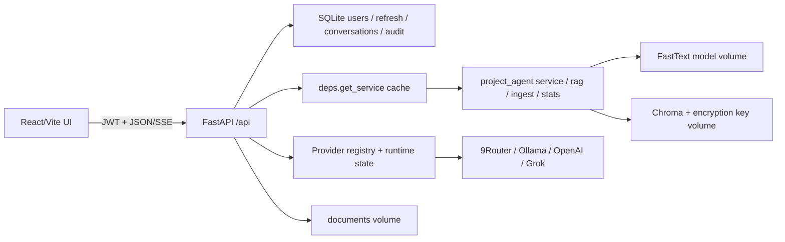

# Kiến trúc AImpact Web

## Luồng chính

## Ranh giới trách nhiệm

### Frontend

- Access token ở bộ nhớ; refresh token ở `sessionStorage` để không tồn tại sau khi đóng phiên trình duyệt.
- Tự xoay refresh khi access hết hạn.
- Parse SSE từ `/api/query`, render Markdown qua `marked` rồi sanitize bằng DOMPurify.
- Không render HTML tài liệu trực tiếp. Nội dung trích dẫn hiển thị dưới dạng text trong `blockquote`.
- Các route Stats, Documents và Admin được code-split; UI framework nặng không được sử dụng.

### FastAPI

- Enforce xác thực/RBAC, rate limit login, cách ly hội thoại và audit metadata.
- Lưu upload vào `documents/`, sau đó gọi `RagService.ingest_path(path, filename)`.
- Đọc thống kê bằng `stats.read_table` + `stats.column_totals`, chỉ lọc cột chỉ mục ở lớp API.
- Không gọi `project_agent.config.validate()`; `api.settings.Settings.validate()` kiểm cấu hình riêng.

### Lõi RAG

Các file trong `project_agent/` được import nguyên trạng. `api.deps.get_service(settings)` dựng một `RagService` và cache theo cấu hình để FastText/Chroma không được khởi tạo lại mỗi request.

Query streaming không dùng `RagService.answer()` vì hàm đó trả kết quả đồng bộ. Route vẫn dùng đúng hai primitive lõi:

1. `index_obj.query(query, embed_fn, top_k)` để retrieve.
2. `rag.answer_or_refuse(query, hits, threshold, history, role)` để gate và dựng citation.

Nếu `prompt is None`, API phát đúng một SSE `final` chứa `rag.NO_EVIDENCE_MESSAGE`, citation rỗng và kết thúc trước khi gọi provider. Nếu có prompt, API stream token provider và đính citation nguyên văn ở event cuối.

## Dữ liệu bền vững

| Đường dẫn | Nội dung |
|---|---|
| `models/` | `cc.vi.300.bin`, chỉ đọc trong container |
| `data/chroma_db/` | Chroma vector index |
| `data/encryption_key.key` | Khóa mã hóa document text trong Chroma |
| `data/app.db` | User, refresh token, conversation, message, audit |
| `data/providers.state.json` | Provider active, model runtime, threshold |
| `history/` | Volume dành cho tương thích/vận hành hiện tại |
| `documents/` | Tệp nguồn đã upload |

`providers.state.json`, database, model, documents và secret không được commit.

## Bảo mật luồng dữ liệu

- Password hash Argon2; không trả hash qua API.
- Refresh token lưu dưới dạng SHA-256, xoay sau mỗi lần dùng và có thể thu hồi toàn bộ.
- Query/answer/document content chỉ nằm trong message/document store cần thiết; audit không chứa các nội dung này.
- Mọi endpoint conversation có điều kiện `conversation.user_id == current_user.id`; sai chủ sở hữu trả 404.
- Provider key chỉ được đọc bằng `os.getenv(key_env)` tại thời điểm gọi provider.

## Deviation kỹ thuật đã biết

Đặc tả đồng thời yêu cầu `ChatOpenAI` và loại toàn bộ `langchain*` khỏi image. Hai yêu cầu không thể cùng đúng. Triển khai dùng `httpx` gọi trực tiếp OpenAI-compatible streaming API, giữ cùng hợp đồng provider và loại được LangChain.

`chromadb==0.5.0` khai báo/import `onnxruntime` cho default embedding function dù AImpact truyền embedding FastText riêng. Vì vậy pip vẫn cài transitive `onnxruntime`; gỡ package làm `import chromadb` thất bại. Không thêm ONNX vào code ứng dụng, nhưng chưa thể loại khỏi image khi giữ đúng phiên bản Chroma.
